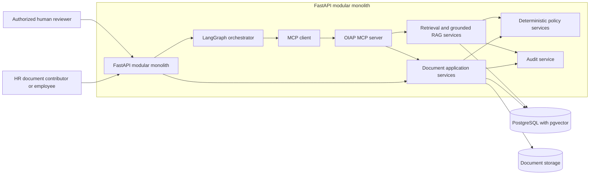

# OIAP Phase 1: HR Document Automation and Knowledge Agent

## Purpose

This document defines the practical Phase 1 architecture for OIAP's first vertical business slice. Phase 1 will prove a governed HR document lifecycle and evidence-grounded HR knowledge retrieval while using synthetic data only. It refines, but does not replace, the long-term system architecture, MVP architecture, ADR-001, ADR-002, the implementation plan, or the synthetic-data policy.

Phase 0 foundation work is completed. The immediate next implementation step is the PostgreSQL and pgvector document foundation. The remaining capabilities described here are staged targets, not current implementation claims.

## Scope

- FastAPI modular-monolith domain, service, repository, provider, workflow, and API boundaries.
- PostgreSQL records for document identity, versions, metadata, lifecycle, approvals, processing runs, chunks, retrieval, and audit linkage.
- pgvector embeddings associated with approved document versions and authorization metadata.
- Synthetic HR source metadata, content validation, standardization, versioning, and review.
- Structured Markdown as the direct source for chunking and RAG.
- Keyword/metadata and semantic retrieval baselines.
- Grounded HR answers with verified citations and explicit non-answer states.
- LangGraph orchestration of explicit document and retrieval workflow states.
- HITL interruption and approval before RAG publication.
- An OIAP MCP server that exposes selected application-service capabilities.
- A controlled HR demonstration and evaluation package.

## Non-goals

- Real company data during current development.
- Creating the synthetic HR corpus in this documentation task.
- Implementing application code, dependencies, migrations, or infrastructure in this documentation task.
- Raw-PDF-to-embedding processing.
- Production identity, deployment, availability, compliance, or security-accreditation claims.
- Microservices or duplicated business logic in MCP tools.
- Autonomous approval, authorization, publication, or sensitive-data decisions.
- Live email, WhatsApp, voice, payment, or other externally visible actions.
- The final PDF/form interface before the core document workflow is proven.

## Synthetic-first strategy

Current development uses only fictional, visibly labelled synthetic HR documents compliant with `docs/synthetic-data-policy.md`. The synthetic set must intentionally exercise the same required metadata, document structures, roles, access restrictions, approval decisions, version transitions, conflicts, ingestion states, citation anchors, and audit expectations planned for real sources.

Synthetic content is not a shortcut around governance. Each version needs deterministic validation and separate human review. Sources remain authoritative; standardized copies, chunks, embeddings, indexes, retrieval runs, and answers are derived artifacts. Synthetic evaluation cannot establish safety, correctness, compliance, or value for real company documents.

## Future real-document replacement

Approved real company PDFs will replace synthetic sources through the same normalized document contract, not through a parallel RAG path. Synthetic sources and artifacts are never relabelled or mixed with real ones.

The later interface presents one form. A user may upload a PDF to pre-fill detectable fields or complete the same form manually. PDF extraction is candidate input only: the user must review and correct it. Required metadata, duplicate/version, sensitive-data, redaction, authority, and access checks must pass before standardized Markdown is created and sent for human approval.

## High-level architecture



The boxes are logical module boundaries, not microservices. MCP wraps the same application services used by other interfaces. PostgreSQL and pgvector are one database foundation.

## Document lifecycle

### Synthetic HR documents

```text
synthetic HR document
-> metadata validation
-> document/content validation
-> standardization
-> structured Markdown
-> human review and approval
-> chunking
-> embeddings
-> pgvector candidate set
-> atomic publication
-> active HR RAG retrieval
```

### Later real company documents

```text
company PDF or manual form
-> extraction and form pre-fill when a PDF is supplied
-> user review and correction
-> required metadata validation
-> duplicate and version checks
-> sensitive-data and redaction checks
-> standardized Markdown
-> human review and approval
-> chunking
-> embeddings
-> pgvector candidate set
-> atomic publication
-> active HR RAG retrieval
```

Raw PDFs never go directly to chunking or embeddings. A failure, rejection, missing approval, or incomplete processing run remains inactive and cannot be retrieved.

## Document metadata contract

Visible form metadata includes document title, document type, department, summary/purpose, language, version, effective date, content owner, approver, approval status, approved-for-RAG flag, document status, access level, permitted/restricted roles where applicable, personal/confidential data declarations, redaction status, content, related documents, keywords, and reviewer notes.

The backend derives tenant/company ID, internal document ID, file/content hashes, normalized title, normalized department/type codes, retrieval category, topic/process tags, security/retrieval scope, chunk IDs, source page/section, embedding version, pipeline version, and processing status. Derived metadata cannot override a required human declaration or deterministic policy decision.

The Phase 1 schema must reconcile these fields with the current YAML contract in `docs/synthetic-data-policy.md`. Any schema expansion requires validation rules, migration/version behavior, fixtures, and documentation before corpus creation.

## RAG ingestion lifecycle

1. Register a candidate document/version and compute stable hashes.
2. Validate required metadata, controlled values, dates, ownership, access declarations, and synthetic labeling.
3. Validate content structure, title/metadata agreement, required sections, prohibited data, and safe Markdown.
4. Standardize content without changing its approved meaning and retain source-to-section traceability.
5. Pause for an authorized human approval decision.
6. On approval, create heading-aware chunks with stable source anchors.
7. Generate versioned embeddings through the embedding-provider abstraction.
8. Persist relational metadata and vectors as an inactive candidate set in PostgreSQL with pgvector.
9. Reconcile counts, hashes, versions, access metadata, and processing results.
10. Atomically activate the approved set and supersede the prior version where applicable.
11. Run keyword/metadata and semantic retrieval evaluation under identical access conditions.

## HITL publication gate

Approval is a durable domain decision, not a button state or an LLM judgment. The gate verifies that the actor has deterministic approval authority for the document's department, type, access level, and sensitivity. It records document/version, decision, reason, reviewer role, timestamp, correlation ID, content/hash reference, and policy/workflow versions.

LangGraph interrupts at the approval state and resumes only from a recorded decision. Resume must be idempotent: duplicate approval messages cannot publish twice. Rejection, correction requested, expired approval, reviewer mismatch, or policy uncertainty fails closed. Publication requires both an approved decision and successful candidate-artifact reconciliation.

## LangGraph responsibilities

LangGraph:

- coordinates explicit document states and transitions;
- pauses and resumes around HITL review;
- sequences MCP capability calls;
- carries stable identifiers and bounded workflow context;
- routes validation, provider, publication, and retrieval failures;
- records workflow version and transition evidence; and
- supports deterministic retry only for safe idempotent operations.

LangGraph does not decide authorization, access policy, document approval authority, publication eligibility, sensitive-data policy, source authority, or conflict resolution.

## MCP responsibilities

OIAP's MCP server exposes meaningful, reusable business capabilities such as:

- validate an HR document;
- check duplicate/version state;
- retrieve an authorized document;
- save standardized Markdown;
- record an approval decision;
- publish an approved document to RAG;
- search authorized HR knowledge; and
- write an audit event.

Each MCP tool validates its transport contract and delegates to an application service. It does not reimplement policy, document lifecycle, repository, or audit logic. Tool input/output schemas, authentication context, idempotency, errors, and versions require contract tests. MCP cannot turn a LangGraph or LLM request into authority.

## PostgreSQL responsibilities

PostgreSQL is the transactional system of record for document identities and versions, visible and derived metadata, content/hash references, lifecycle states, approvals, access rules, processing runs, chunk metadata, embedding-set metadata, workflow checkpoints, retrieval/audit references, and uniqueness/consistency constraints. Transactions support candidate isolation, approval recording, atomic activation, superseding, rollback, and idempotency.

Repository interfaces keep SQL and persistence concerns out of domain services. Least-privilege roles, migrations, backups, restore, retention, and deletion behavior must be designed and tested before controlled demonstration acceptance.

## pgvector responsibilities

pgvector stores embeddings inside PostgreSQL, linked to stable document-version, chunk, authorization, and embedding-set records. Queries apply active-version and access predicates before evidence leaves persistence. Vector distance is a ranking signal, not confidence. Dimension/model mismatches fail closed, and a new embedding model creates an evaluated candidate set rather than silently replacing active vectors.

Keyword/metadata retrieval remains the first measured baseline. Semantic pgvector retrieval must use the same corpus, identities, authorization predicates, top-k rules, questions, and metrics for a fair comparison.

## Source and derived-artifact distinction

| Kind | Examples | Authority and lifecycle |
|---|---|---|
| Source | Approved synthetic HR Markdown; later approved PDF plus reviewed standardized Markdown record | Human-governed input with ownership, version, access, and retention decisions |
| Normalized source | Standardized Markdown and its source mapping | Direct RAG source after approval; traceable to submitted content |
| Derived artifact | Chunks, embeddings, pgvector indexes, manifests, retrieval runs, prompts, answers | Rebuildable/versioned; never treated as source authority |
| Evidence record | Validation results, approval decision, hashes, audit events, evaluation results | Supports traceability and gates without replacing source content |

## Expected first synthetic HR document categories

1. HR and General Employee Policy.
2. Leave Policy.
3. Employee Onboarding Procedure.
4. Employee Role and Responsibility Directory.
5. HR Responsibility and Routing Matrix.
6. HR Approval and Escalation Matrix.
7. HR FAQ and Approved Answer Set.

All documents must be fictional, visibly synthetic, internally consistent, separately reviewed, and compliant with `docs/synthetic-data-policy.md`. Category approval does not authorize document creation in this task.

## Implementation sequence

1. Retain the completed Phase 0 foundation and its evidence boundaries.
2. Implement PostgreSQL and pgvector configuration, schema, migrations, repositories, and recovery-oriented tests.
3. Approve the expanded HR metadata schema and synthetic corpus design.
4. Implement metadata/content validation and standardized-Markdown services.
5. Create and review the synthetic HR corpus only after separate authorization.
6. Implement and measure keyword/metadata retrieval.
7. Implement and fairly compare semantic pgvector retrieval.
8. Add grounded LLM RAG with verified citations and explicit answer statuses.
9. Add LangGraph document workflow and the durable HITL publication gate.
10. Add the OIAP MCP server over stable application-service contracts.
11. Run the controlled HR demonstration and evaluation gates.
12. Replace synthetic sources only after the real-document transition gate.
13. Build the final PDF/form automation interface after the core workflow is proven.

## Acceptance criteria

- [ ] Phase 0 remains intact and no capability is claimed beyond evidence.
- [ ] PostgreSQL with pgvector operates as one tested database foundation.
- [ ] Synthetic HR sources comply with the synthetic-data policy and approved metadata schema.
- [ ] Invalid, unapproved, failed, superseded, and archived versions cannot enter normal retrieval.
- [ ] Structured Markdown is the direct RAG source; raw PDFs cannot reach embeddings.
- [ ] Approval authority and publication eligibility are deterministic and deny-by-default.
- [ ] HITL interruption/resume is durable, idempotent, auditable, and required before activation.
- [ ] LangGraph orchestrates but does not authorize, approve, publish by discretion, or decide sensitive-data policy.
- [ ] MCP tools wrap application services and pass contract, authorization-context, error, and idempotency tests.
- [ ] Keyword/metadata retrieval is measured before semantic retrieval under fair conditions.
- [ ] pgvector retrieval filters lifecycle and access before evidence reaches the LLM.
- [ ] Grounded answers use authorized evidence and verified citations; unsupported and conflicting cases fail closed or escalate.
- [ ] Source, normalized source, derived artifacts, and evidence records remain distinguishable and versioned.
- [ ] The controlled demonstration uses only fictional synthetic data and makes no production-readiness claim.
- [ ] Real-document replacement requires separate owner, security, privacy/legal as applicable, access, evaluation, recovery, and Go/No-Go evidence.

## Related documents

- `docs/architecture/system-architecture.md`
- `docs/architecture/mvp-architecture.md`
- `docs/implementation/mvp-implementation-plan.md`
- `docs/framework/framework-application-plan.md`
- `docs/synthetic-data-policy.md`
- `docs/decisions/ADR-001-vector-database.md`
- `docs/decisions/ADR-002-hr-first-document-automation.md`
