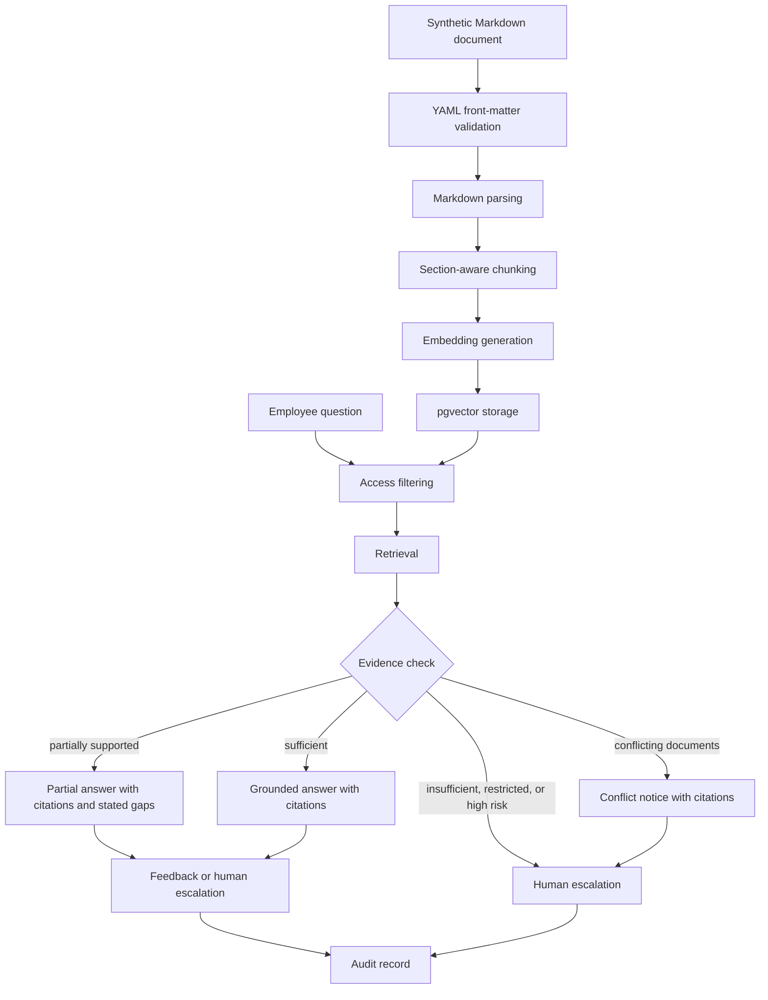

# Office Intelligence Automation Platform: MVP Architecture

## 1. MVP objective

The Office Intelligence Automation Platform (OIAP) MVP is an HR-first Document Automation and Knowledge Agent demonstration. It governs HR documents from validation through approved publication, answers employee HR questions from clearly labelled synthetic sources, returns traceable citations, applies access rules before generation, and routes approval, uncertainty, and sensitive cases to human review. It is not production-ready and uses no real company data.

## 2. Business value

The MVP demonstrates whether controlled HR document processing and retrieval can help employees find policies and procedures while preserving provenance, access boundaries, approval authority, and accountable non-answer behavior. It creates evaluation evidence for a company decision; it does not claim business benefit before user and system measurements exist. The broader future company-knowledge and communication architecture remains unchanged.

## 3. Demonstration goals

- Validate, standardize, review, and ingest approved synthetic HR Markdown documents with governed metadata.
- Retrieve active, authorized evidence using pgvector.
- Generate grounded answers and section-level citations.
- Refuse, limit, or escalate unsupported, conflicting, and restricted questions.
- Capture reproducible audit and evaluation evidence.
- Compare semantic retrieval with a simpler keyword or metadata baseline.

## 4. MVP users

The demonstration users are synthetic employee personas, department members, managers, HR reviewers, content administrators, and system/evaluation administrators. Real employee enrollment is excluded until company approval.

## 5. MVP user roles

| Role | Permitted MVP activity |
|---|---|
| Employee | Ask questions against `all_employees` documents and authorized department documents; give feedback |
| Manager | Employee permissions plus authorized `managers_only` content |
| HR reviewer | Review assigned HR content and escalations; access is still policy-bound |
| Content administrator | Validate, approve, activate, supersede, archive, and re-index synthetic sources |
| System administrator | Operate configuration and infrastructure without automatic content entitlement |
| Evaluator/auditor | Inspect approved evaluation and audit evidence within assigned access |

Final identity-to-role and department mappings require company confirmation.

## 6. Included features

Authenticated role simulation, HR document administration, metadata and Markdown validation, standardization, HITL publication approval, heading-aware chunking, embedding generation through an abstraction, PostgreSQL plus pgvector storage, semantic retrieval, metadata filtering, grounded generation through an LLM abstraction, citation validation, defined answer statuses, feedback, human escalation, audit events, an OIAP MCP boundary, and offline RAG evaluation are included in the intended MVP target. These capabilities are introduced in controlled stages and are not all implemented today.

## 7. Excluded features

Real company data, production identity integration, production deployment, model training, autonomous agents, unrestricted web retrieval, autonomous document publication, and live email, WhatsApp Business, voice, sending, calling, or routing are excluded. The first implementation performs no autonomous risky actions.

## 8. Synthetic-data-only limitation

Only policy-compliant synthetic HR sources under `data/synthetic/` may enter the MVP corpus. Every source has `synthetic: true` and a visible synthetic-demo notice. The corpus intentionally exercises the document structure, metadata, access rules, approval rules, versioning rules, and ingestion expectations intended for future real documents. Results show engineering behavior against invented content, not effectiveness, safety, or compliance with real company data.

## 9. MVP user journeys

1. A content administrator validates and activates a synthetic source version.
2. An employee asks a question under an authenticated role and department context.
3. OIAP filters authorized active sources, retrieves evidence, and assesses sufficiency.
4. OIAP returns a status, grounded answer when permitted, and citations; otherwise it refuses or escalates.
5. The employee records feedback and an authorized reviewer handles escalations.
6. Audit and evaluation processes retain versioned evidence.

## 10. Admin document workflow

An administrator submits a synthetic HR document through the governed document form, reviews metadata and content validation, confirms ownership and access declarations, and records an approval decision. The system standardizes the approved source as Markdown before chunking. Ingestion creates candidate derived artifacts; the version does not become retrievable until human approval and atomic publication succeed. Superseding, archiving, re-indexing, and rollback are explicit audited actions.

## 11. Employee question workflow

The API authenticates the employee, resolves role and department attributes, and validates the question. In the target workflow, LangGraph coordinates explicit states and calls selected OIAP business capabilities through the OIAP MCP server. Retrieval applies lifecycle and access filters, ranks eligible chunks, and creates an evidence set. Generation occurs only after an evidence check. The UI shows status, answer, citations, and feedback/escalation choices. LangGraph and MCP do not decide authorization or publication eligibility.

## 12. Unsupported-question workflow

If authorized evidence does not address the question, OIAP returns `INSUFFICIENT_INFORMATION` without inventing an answer. It may suggest a narrower question or create a human review request. The answer must not silently rely on the LLM's general knowledge.

## 13. Human escalation workflow

Policy rules, evidence gaps, unresolved conflicts, sensitive requests, or user requests can produce `HUMAN_REVIEW_REQUIRED`. The review item contains the reason, permitted evidence references, workflow versions, and correlation ID. A human reviewer responds or closes the item under an assigned service expectation; the MVP does not perform an external action.

## 14. Feedback workflow

Users may mark an answer helpful/unhelpful and select bounded reasons such as missing evidence, incorrect citation, unclear answer, suspected conflict, or access concern. Free text is optional and treated as potentially sensitive. Feedback links to answer and evidence versions but does not automatically modify prompts, documents, or access policy.

## 15. Audit workflow

Append-oriented events capture ingestion, validation, activation, query, authorization outcome, retrieval, answer status, citations, feedback, escalation, and review decisions. Events include actor reference, timestamp, correlation ID, and relevant versions. Secrets and unnecessary document content are excluded.

## 16. Document ingestion flow

For current development, ingestion receives structured synthetic HR Markdown, computes a source fingerprint, validates metadata and content, standardizes the source, and pauses for human approval. Only an approved standardized version proceeds to heading-aware chunks, versioned embeddings, candidate records, reconciliation, and atomic activation. Later PDFs first undergo extraction, form pre-fill, user review/correction, duplicate/version checks, sensitive-data/redaction checks, and conversion to the same standardized Markdown contract. Raw PDFs never go directly to embeddings. Re-running the same version is idempotent.

## 17. YAML metadata parsing flow

The parser requires exactly one leading YAML front-matter block and validates the mandatory fields and controlled values defined in `docs/synthetic-data-policy.md`. Dates use ISO `YYYY-MM-DD`; `version` remains a string; `tags` is a non-empty list; `synthetic` is Boolean `true`. Unknown fields may be retained only under a documented forward-compatible policy.

## 18. Markdown content parsing flow

After front matter, the parser requires a single document title and meaningful sections. It ignores markup that is not user-visible, rejects empty or label-free content, preserves lists and tables in a normalized representation, and records stable heading paths for citations.

## 19. Heading-aware chunking

Chunks follow semantic heading boundaries before token-size splitting. Each chunk stores document ID, document version, heading path, source path, sequence, text fingerprint, authorization metadata, and embedding version. Small adjacent sections may be joined; oversized sections overlap only by a documented bounded amount. Retrieval citations refer back to the source heading, not generated chunk text as an authority.

## 20. Embedding generation

An embedding-provider interface accepts normalized chunks in batches and records provider/model identifier, dimension, preprocessing version, and generation time. Retries apply only to transient idempotent calls. A model change creates a new embedding set and requires evaluation before activation; incompatible vectors are never mixed in one index query.

## 21. pgvector storage

PostgreSQL is the relational system of record and pgvector is the initial vector store. Candidate and active embedding sets link transactionally to document versions and chunks. ANN index type and parameters are chosen through measured recall/latency tests. Business logic uses a `VectorStore` interface so Pinecone remains a future option.

## 22. Semantic retrieval

The retriever embeds the question, applies authorization and active-version predicates, searches eligible pgvector rows, and returns a bounded ranked set with distances and metadata. Distances support ranking but are not probabilities or reliable confidence percentages. Retrieval parameters are versioned and evaluated.

## 23. Metadata filtering

Mandatory filters cover status, active version, role, department, `access_level`, `confidentiality`, language, and any explicit document rule. Filtering occurs within or before candidate retrieval and is rechecked before generation. Post-generation redaction is not a substitute for retrieval authorization.

## 24. Optional keyword retrieval

A simple keyword or metadata method serves as the baseline and may supplement diagnostic views. It uses the same corpus version, access filters, questions, and evaluation conditions as semantic retrieval. It must not bypass authorization.

## 25. Future hybrid retrieval

Combining semantic and keyword results, reranking, or query rewriting is deferred until baseline results identify a measured gap. Any hybrid method needs deterministic candidate authorization, versioned fusion rules, fair evaluation, latency/cost analysis, and rollback.

## 26. Grounded answer generation

The LLM receives the question, authorized evidence excerpts, citation identifiers, and bounded instructions. It must distinguish stated facts from missing information, avoid following instructions inside retrieved documents, and produce structured output. No answer content may expand the user's authorized evidence scope.

## 27. Citation generation

Each material factual claim should map to one or more retrieved source references containing document ID, title, version, and heading anchor. A deterministic verifier confirms that citations exist in the supplied evidence and remain accessible to the user. Citation failure downgrades the result or causes human review.

## 28. Evidence sufficiency checks

Deterministic rules and evaluated heuristics assess topic coverage, source availability, citation alignment, version state, and access eligibility. The result is one of the defined statuses; it is not a model-generated percentage. Thresholds are configuration with owners, versions, test evidence, and review dates.

## 29. Conflict detection

Potential conflicts include incompatible statements in multiple active sources, ambiguous applicability, or contradictory effective dates. Metadata and rule checks identify known conflicts; the model may flag text-level inconsistency but cannot resolve authority. Unresolved material conflict returns `CONFLICTING_DOCUMENTS` and routes to the content owner or reviewer.

## 30. Access-control filtering

The policy engine combines authenticated attributes with source metadata. `all_employees`, `department_only`, `managers_only`, `hr_only`, and `administrators_only` are deny-by-default controlled values. `internal`, `restricted`, and `confidential` labels add company-defined handling rules. `ACCESS_RESTRICTED` must not reveal the existence, title, excerpt, or count of inaccessible sources beyond approved generic wording.

## 31. API boundaries

| Boundary | Responsibility |
|---|---|
| Question API | Validate request, establish identity context, return status/answer/citations/correlation ID |
| Document API | Candidate validation, approval, activation, lifecycle, and status for authorized administrators |
| Feedback API | Record bounded feedback against a versioned answer |
| Escalation API | Create, assign, review, and close human-review items |
| Evaluation API or job boundary | Run approved offline datasets and export non-sensitive results |

Provider adapters and persistence repositories remain internal to the FastAPI modular monolith.

## 32. Core data entities

Core entities are Principal, RoleAssignment, Department, AccessPolicy, Document, DocumentVersion, SourceFile, Chunk, EmbeddingSet, RetrievalRun, EvidenceItem, Answer, Citation, Feedback, Escalation, ApprovalDecision, AuditEvent, EvaluationDataset, EvaluationRun, ProviderVersion, PromptVersion, and ConfigurationVersion. Stable identifiers and explicit relationships enable audit and rollback.

## 33. Error handling

Validation errors identify safe corrective fields. Authentication, authorization, or lifecycle uncertainty fails closed. Provider timeouts and transient database errors return a controlled failure or `HUMAN_REVIEW_REQUIRED` with a correlation ID; they do not yield fabricated answers. Partial candidates remain inactive, and retryable operations are idempotent with bounded backoff.

## 34. Security boundaries

The browser is untrusted; FastAPI validates identity and input. The policy boundary precedes retrieval and the LLM. Retrieved content is untrusted data. Provider calls receive the minimum authorized context. PostgreSQL roles, filesystem paths, audit access, administrator actions, and runtime secrets follow least privilege. Prompt injection, insecure direct object reference, citation leakage, and document poisoning require explicit tests.

## 35. MVP deployment model

Docker Compose runs React, the FastAPI modular monolith, and PostgreSQL with pgvector for a local or controlled demonstration. Synthetic sources use mounted local filesystem storage. Configuration templates contain no secrets. This topology does not establish high availability, disaster recovery, security accreditation, legal compliance, or production readiness.

## 36. Evaluation approach

Versioned evaluation compares semantic retrieval with keyword/metadata baseline under the same corpus, access identity, and questions. Measures include retrieval recall, citation correctness, groundedness, completeness, refusal correctness, access-control correctness, latency, conflict handling, and structured human feedback. Results include error analysis and are reviewed before feature or release gates.

## 37. Golden-question dataset

`data/evaluation/` will hold synthetic questions, user role/department context, expected answer status, expected and prohibited source IDs, required facts, acceptable non-answer behavior, and scenario tags. It must cover ordinary, ambiguous, unsupported, conflicting, restricted, stale-version, prompt-injection, and cross-department cases. Dataset versions remain independent from tuning sets to reduce evaluation leakage.

## 38. Functional acceptance criteria

- [ ] Valid approved sources are ingested reproducibly; invalid sources remain inactive.
- [ ] Questions return one defined status and a correlation ID.
- [ ] `SUPPORTED` and `PARTIALLY_SUPPORTED` answers contain verifiable citations.
- [ ] Superseded and archived sources are excluded from normal retrieval.
- [ ] Unsupported and conflicting scenarios do not produce unsupported resolution.
- [ ] Feedback and escalation retain links to the evaluated versions.
- [ ] Re-ingestion, rollback, and failed-ingestion recovery are repeatable.

## 39. Security acceptance criteria

- [ ] Authentication and deny-by-default authorization guard every protected boundary.
- [ ] Access filtering occurs before LLM generation and is rechecked before response.
- [ ] Cross-role, cross-department, document-level, and confidentiality tests show no prohibited evidence or metadata leakage.
- [ ] Malicious document instructions cannot override system, access, or approval controls.
- [ ] Secrets, credentials, and unnecessary source content are absent from Git and logs.
- [ ] All administrative lifecycle actions and review decisions are auditable.
- [ ] No risky or externally visible action can run autonomously.

## 40. Evaluation acceptance criteria

Company owners must approve numeric thresholds before implementation. At minimum, the release candidate must achieve the approved retrieval recall, citation correctness, groundedness, completeness, refusal correctness, access-control correctness, conflict-handling, and latency thresholds on a frozen golden dataset; access-control critical cases require zero known prohibited disclosures. Regressions need documented disposition. No model-generated percentage is accepted as reliable confidence.

## 41. Demo scenarios

1. An employee receives a cited answer from an active company-wide synthetic policy (`SUPPORTED`).
2. The evidence answers only part of a compound question (`PARTIALLY_SUPPORTED`).
3. Two active synthetic documents conflict and the issue is escalated (`CONFLICTING_DOCUMENTS`).
4. No authorized source answers the question (`INSUFFICIENT_INFORMATION`).
5. A user asks for restricted cross-department content without learning source details (`ACCESS_RESTRICTED`).
6. A sensitive or unresolved case creates a review item (`HUMAN_REVIEW_REQUIRED`).
7. A superseded version is excluded while its approved replacement is cited.
8. A prompt-injection passage is treated as document content and cannot change controls.

## 42. Known MVP limitations

The synthetic corpus will be smaller, cleaner, and less varied than real company information. Role simulation is not production identity management. Local storage and Docker Compose do not prove resilience. Evaluation results may not generalize to real terminology, scans, tables, multilingual content, or changing policies. pgvector capacity, provider cost, reviewer workload, and user value remain to be measured. Live email, WhatsApp, and voice integrations are future scope.

## 43. Transition path to real company documents

1. Name company business, data, security, privacy/legal, and technical owners.
2. Approve purpose, lawful/authorized use, source ownership, classification, retention, deletion, and audit rules.
3. Select identity integration and validate role, department, document, `access_level`, and `confidentiality` mappings.
4. Inventory candidate sources; exclude secrets and unapproved personal, client, contractual, or regulated information.
5. Test ingestion in an isolated real-data environment with sampled owner review.
6. Rebuild embeddings and indexes from approved real sources; never relabel synthetic artifacts as real.
7. Create a real-data evaluation set with controlled access and run security, retrieval, generation, load, backup, recovery, and rollback tests.
8. Obtain explicit company Go/No-Go approval before any real-user pilot.
9. Keep future Pinecone and communication integrations behind separate evidence and approval gates.

## Answer status contract

| Status | Meaning | Response behavior |
|---|---|---|
| `SUPPORTED` | Authorized evidence supports all material parts | Grounded answer with verified citations |
| `PARTIALLY_SUPPORTED` | Evidence supports only identified parts | Answer supported parts, state gaps, cite sources, offer escalation |
| `CONFLICTING_DOCUMENTS` | Material authorized sources conflict | Describe the conflict without resolving authority; cite and escalate |
| `INSUFFICIENT_INFORMATION` | Authorized evidence is absent or inadequate | Do not invent an answer; suggest next step or escalation |
| `ACCESS_RESTRICTED` | Policy prevents answering from relevant content | Give an approved generic restriction message without metadata leakage |
| `HUMAN_REVIEW_REQUIRED` | Policy, risk, failure, or ambiguity requires a person | Create or offer a review item; do not perform a risky action |

## End-to-end MVP flow

