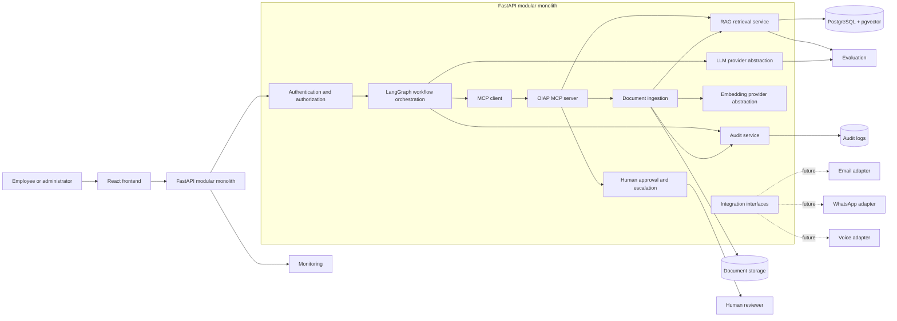

# Office Intelligence Automation Platform: System Architecture

## 1. Document purpose

This document defines the target architecture and governing boundaries for the Office Intelligence Automation Platform (OIAP). It is a design record for engineers, company decision-makers, AI engineers, security reviewers, and future auditors. The current phase covers architecture, governance, engineering decisions, and synthetic-data design only; it does not authorize implementation or production use.

## 2. Business context

Companies hold useful knowledge across policies, procedures, handbooks, and communication channels. Employees need timely answers, while management needs access controls, traceability, and accountable handling of uncertain or sensitive requests. OIAP is intended to provide a controlled foundation for knowledge retrieval and, later, approved communication workflows.

## 3. Current problem

Employees may not know which document is authoritative, may receive inconsistent answers, or may lack a clear escalation route. Directly connecting a generative model to company information would create unacceptable risks: access leakage, unsupported answers, weak provenance, and unaudited actions. OIAP must separate retrieval, authorization, generation, approval, and audit responsibilities.

## 4. Long-term platform vision

The long-term platform may support secure company knowledge retrieval, document ingestion and semantic search, email reading and draft replies, human-approved email sending, WhatsApp Business handling, call answering and caller-information capture, storage and routing of communication information, human approval workflows, monitoring, and evaluation. These capabilities are future scope unless explicitly included in an approved delivery stage.

The first vertical business slice is an HR Document Automation and Knowledge Agent. Current development uses clearly labelled synthetic HR Markdown documents with governed metadata. Approved real company documents may replace those sources later through the same controlled lifecycle; the core interfaces, metadata model, authorization rules, approval gates, and security boundaries should not require redesign.

## 5. Architecture goals

- Return evidence-grounded answers with source citations.
- enforce role-, department-, document-, and confidentiality-based access before generation;
- make unsupported, conflicting, or restricted outcomes explicit;
- preserve traceable document, retrieval, model, approval, and configuration versions;
- keep irreversible or externally visible actions under human control;
- enable provider substitution through LLM, embedding, and vector-store abstractions;
- start with low operational complexity while retaining a measured evolution path; and
- support reproducible evaluation, monitoring, rollback, and recovery.

## 6. Architecture principles

1. **Modular monolith first.** React is the presentation application and FastAPI hosts cohesive backend modules deployed together. Service extraction requires operational evidence.
2. **Authorization before disclosure.** Access filtering occurs before retrieved content is supplied to an LLM.
3. **Evidence before generation.** Answers require sufficient authorized evidence and citations; absence of evidence produces an explicit non-answer or escalation.
4. **Deterministic controls around probabilistic models.** Code and policy checks, not an LLM, decide access, action authorization, document state, and approval requirements.
5. **Human authority over risky actions.** The first implementation performs no autonomous risky or externally visible action.
6. **Source documents are authoritative.** Chunks, embeddings, indexes, prompts, and model output are derived artifacts.
7. **Least privilege and data minimization.** Each component and user receives only the data needed for the current task.
8. **Reviewable evolution.** Baselines, decisions, risks, exceptions, and gate outcomes retain evidence.

## 7. Assumptions

- MVP content is English-language synthetic HR demo content only.
- The expected MVP corpus and retrieval traffic fit a single PostgreSQL deployment with pgvector.
- A company identity source and final role/department model will be selected before real users or data are introduced.
- Human reviewers are available for escalation and future communication approvals.
- Docker Compose is an initial reproducible deployment mechanism, not evidence of production readiness.
- Local filesystem document storage is acceptable for the synthetic MVP; object storage is evaluated before production or multi-instance deployment.

## 8. Constraints

- Backend: FastAPI; frontend: React; workflow orchestration: LangGraph.
- Primary data store: PostgreSQL; initial vector store: pgvector.
- Source format: Markdown with mandatory YAML front matter.
- MVP data: synthetic only under `data/synthetic/`.
- Testing, linting, and type checking are planned with Pytest, Ruff, and MyPy.
- Secrets must not be committed or written into documents, logs, prompts, or audit payloads.
- Current work is documentation-only; implementation, dependency changes, and synthetic-document generation are excluded.

## 9. In-scope capabilities

The architecture covers identity integration, authorization, document administration, ingestion, parsing, heading-aware chunking, embeddings, indexed retrieval, evidence checks, grounded generation, citations, feedback, human escalation, audit events, evaluation, and operational telemetry. The first MVP slice is limited to synthetic HR document automation and knowledge retrieval while retaining the broader future company architecture.

## 10. Out-of-scope capabilities for the current phase

Application code, synthetic document generation, real company data ingestion, production deployment, live email/WhatsApp/voice connectivity, autonomous sending or calling, legal or regulatory compliance claims, model training, and service decomposition are out of scope.

## 11. High-level system context

The diagram shows logical boundaries, not separate deployable services. The backend begins as a modular monolith and may evolve into services only when operational evidence justifies the additional complexity.

## 12. Presentation layer

The React frontend provides authenticated question, citation, feedback, escalation, document-administration, and reviewer views. It must render answer status and sources distinctly, avoid exposing inaccessible metadata, preserve request correlation identifiers, and require explicit confirmation for any future externally visible action.

## 13. API layer

FastAPI exposes versioned boundaries for sessions, questions, documents, feedback, escalation, and administration. Schemas validate payload size, type, and allowed values. API handlers establish identity and request context, call domain modules, and return stable status codes; they do not embed authorization or model prompts directly.

## 14. Authentication and authorization layer

Authentication will integrate with a company-approved identity provider after that provider is selected. Authorization combines role-based access control, department-based access control, document `access_level`, `department`, and `confidentiality`, and explicit document rules. Deny-by-default policy evaluation occurs both during retrieval and before response construction. Administrative privileges do not imply unrestricted content disclosure unless company policy explicitly grants it.

## 15. AI orchestration layer

LangGraph coordinates bounded workflow states and HITL interruptions for document validation, review, publication, retrieval, evidence assessment, generation, citation verification, feedback, and escalation. State transitions and approval checkpoints are explicit. LangGraph does not decide authorization, access policy, approval authority, publication eligibility, or sensitive-data policy; deterministic application and governance services do. Workflow and prompt versions are recorded for evaluation and audit.

### 15.1 MCP boundary

OIAP will expose selected reusable business capabilities through its own MCP server, including document validation, duplicate/version checks, standardized-Markdown persistence, approval recording, approved publication, authorized HR knowledge search, retrieval, and audit-event creation. LangGraph calls these capabilities through an MCP client. MCP tools wrap application services and must not duplicate authorization, validation, publication, repository, or audit business logic. The MCP server remains a logical module/boundary within the modular monolith unless future operational evidence supports a separately approved deployment change.

## 16. Knowledge and RAG layer

The knowledge module owns source registration, document versions, chunks, retrieval, evidence sets, answer status, and citations. It treats active, authorized source documents as truth inputs and excludes superseded or archived documents from normal retrieval. It exposes domain interfaces rather than database-specific behavior.

## 17. Document ingestion layer

Ingestion accepts only approved locations and file types. Synthetic HR sources enter as structured Markdown and must pass metadata/content validation, standardization, and human approval before chunking or embedding. Later real PDFs require extraction, form pre-fill, user review/correction, required-metadata validation, duplicate/version and sensitive-data/redaction checks, and standardized-Markdown conversion. A raw PDF is never sent directly to embeddings. Failed validation or missing human approval prevents publication to the active index; partial ingestion must not appear active.

## 18. Retrieval layer

Retrieval receives an authenticated principal, normalized question, and access context. It applies metadata authorization filters, excludes inactive versions, performs pgvector similarity search, and returns ranked evidence with source identifiers and section anchors. A simple keyword or metadata baseline is retained for comparison; hybrid retrieval is future work unless evaluation justifies it.

## 19. LLM generation layer

The LLM provider abstraction supplies only authorized evidence, a bounded instruction, and the user question. The model must not infer permissions or silently supplement evidence from general knowledge. Output is schema-validated and mapped to defined statuses. A model-generated percentage is not treated as reliable confidence.

## 20. Human approval and escalation layer

Escalation creates a review item containing the permitted question context, evidence references, reason, and audit correlation identifier. Reviewers act within assigned roles. Future email sending, WhatsApp replies, voice follow-up, or other risky actions require explicit human approval at execution time; draft generation is not authorization to send.

## 21. Integration layer

Adapter interfaces isolate external systems. Future email, WhatsApp Business, and voice adapters translate provider events into internal commands and convert approved internal actions into provider calls. Adapters must support idempotency, signature validation, rate limits, redaction, correlation, and failure reporting. No live adapter is part of the MVP.

## 22. Data layer

PostgreSQL stores identities or identity references, authorization metadata, document manifests and versions, chunks, workflow state, feedback, escalation records, and audit references. pgvector stores embeddings alongside relational metadata. The local filesystem stores MVP source documents. Logical schemas and repository interfaces limit coupling and allow future object storage or Pinecone adoption.

## 23. Security layer

Security controls include deny-by-default authorization, input validation, output encoding, least-privilege database roles, encryption in transit, organization-approved encryption at rest, secret injection, prompt-injection defenses, restricted retrieval, dependency and image scanning when implementation begins, and redaction. Retrieved document instructions are treated as untrusted content, not system commands. Threat modeling and organization-specific security review are required before real data or users.

## 24. Audit layer

Append-oriented audit events record actor or system identity, action, timestamp, correlation ID, authorization result, document/chunk versions, workflow and prompt versions, model/provider identifiers, answer status, citations, approval decisions, and outcome. Logs should avoid unnecessary content and secrets. Retention, tamper evidence, access, and export requirements remain company decisions.

## 25. Observability layer

Structured logs, metrics, and traces cover request latency, stage latency, retrieval results, status distribution, authorization denials, ingestion failures, provider errors, escalation queues, and resource use. Monitoring data uses pseudonymous identifiers where feasible and follows approved retention. Alerts must point to a human-owned response path.

## 26. Evaluation layer

Evaluation uses versioned golden questions and expected sources to measure retrieval recall, citation correctness, groundedness, completeness, refusal correctness, access-control correctness, conflict handling, latency, and user feedback. Results are segmented by role, department, document type, and answer status where sample sizes permit. Evaluation evidence gates advanced methods and releases.

## 27. Deployment model

The initial deployment uses Docker Compose for React, FastAPI, and PostgreSQL with pgvector, plus mounted synthetic source storage and explicit configuration. This supports local and controlled demonstration environments. Production topology, availability, managed services, network zones, capacity, and disaster recovery require separate approval and evidence.

## 28. Configuration and secrets strategy

Non-secret defaults may be documented in a version-controlled example environment file. Environment-specific configuration and secrets are injected at runtime through an approved secret mechanism. Configuration is typed and validated at startup. LLM, embedding, index, prompt, threshold, and access-policy versions are recorded without recording secret values.

## 29. Data lifecycle

Data states are proposed as received, metadata_validated, content_validated, standardized, pending_approval, approved, indexed, active, superseded or archived, and deleted. Processing creates traceable derived artifacts. Only an explicitly approved standardized-Markdown version may proceed to chunking, embeddings, pgvector, and active retrieval. Retention, legal hold, deletion time frames, and backup scope must be decided by the company before real data. Synthetic data must remain separated from any future real-data environment.

## 30. Document version lifecycle

A new source version receives validation and human approval before activation. Activation atomically makes its chunks retrievable and supersedes the prior active version when applicable. Superseded versions remain available only for permitted audit or tests; archived versions are excluded by default. Rollback reactivates a validated prior version and rebuilds or switches the corresponding index set.

## 31. Failure handling

The system fails closed on identity, authorization, document-state, or evidence-validation errors. Provider or retrieval failure yields a controlled error or `HUMAN_REVIEW_REQUIRED`, never an invented answer. User-facing messages use correlation IDs and do not disclose internal details. Partial writes are rolled back or marked failed and excluded from active retrieval.

## 32. Retry and recovery approach

Retries are limited to transient, idempotent operations with exponential backoff and jitter. Idempotency keys protect ingestion and future communications from duplicate effects. Non-idempotent actions and policy denials are not automatically retried. Recovery procedures cover database restore, source/index reconciliation, re-embedding, queue replay, and audit verification; each must be tested before production approval.

## 33. Rollback approach

Application rollback uses versioned images and compatible database migrations. Document rollback activates a previously approved version. Model, prompt, embedding, and retrieval configuration rollback uses recorded versions. Schema changes require forward and backward compatibility plans, backup validation, and a named decision owner.

## 34. Future communication integrations

Email may support reading and draft replies; WhatsApp Business may support inbound handling and approved responses; voice may support call answering and caller-information capture. Information may be stored and routed to responsible employees only under approved policies. Consent, retention, regional, provider, and human-approval requirements are unresolved. No autonomous risky actions are permitted in the first implementation.

## 35. Future service decomposition criteria

Extraction from the modular monolith is considered only when measured needs demonstrate independently scaling workloads, isolation of sensitive integrations, materially different availability requirements, team ownership boundaries, deployment bottlenecks, or fault-containment needs. A decomposition proposal must include operational data, interface ownership, consistency impacts, security changes, observability, migration, cost, and rollback.

## 36. Technology decisions

| Area | Initial decision | Boundary or rationale |
|---|---|---|
| Architecture | Modular monolith | Lowest justified operational complexity; modular domain boundaries retained |
| Frontend | React | Authenticated user and administration interface |
| Backend | FastAPI | Typed HTTP API and orchestration host |
| Workflow | LangGraph | Explicit state and human-interrupt workflows; not an authorization engine |
| Business tool boundary | OIAP MCP server | Wraps application services for LangGraph; contains no duplicate core business logic |
| Database | PostgreSQL | Transactional system of record |
| Vector store | pgvector | Relational/vector consistency and simpler filtering; see `docs/decisions/ADR-001-vector-database.md` |
| Documents | Local filesystem for MVP | Synthetic single-environment source storage; object storage later |
| Source format | Markdown plus YAML | Human-reviewable content with mandatory metadata |
| Providers | LLM and embedding interfaces | Avoid business-logic dependency on one provider |
| Vector access | `VectorStore` interface | Preserve a future Pinecone option |
| Deployment | Docker Compose initially | Reproducible demonstration, not production-readiness evidence |
| Quality tools | Pytest, Ruff, MyPy | Planned automated testing, linting, and type checking |

## 37. Known risks

| Risk | Initial treatment |
|---|---|
| Unauthorized retrieval or citation leakage | Pre-retrieval filters, post-retrieval checks, adversarial access tests |
| Unsupported or incomplete answers | Evidence thresholds, explicit statuses, citations, escalation |
| Prompt injection in documents | Treat content as data, isolate instructions, test malicious passages |
| Conflicting or stale documents | Version lifecycle, conflict status, owner review |
| pgvector load affects transactional data | Capacity metrics, query/index tuning, separation or Pinecone revisit |
| Synthetic corpus hides real-data complexity | Synthetic-to-real gate, sampled human review, staged ingestion |
| Audit logs expose content | Minimize, redact, restrict, and define retention |
| Provider change alters behavior | Versioned interfaces, regression evaluation, rollback |
| Communication automation causes external harm | No autonomous action; explicit approval and idempotency |

## 38. Open company decisions

- Business owner, architecture owner, security owner, data owners, and escalation reviewers.
- Identity provider, role mapping, department source, and administrator boundaries.
- Authoritative source owners and real-document approval criteria.
- Acceptable retrieval/evaluation thresholds and latency targets.
- LLM and embedding providers, permitted data regions, and provider retention settings.
- Classification mapping, audit/log retention, legal hold, deletion, and backup policies.
- Deployment environment, network controls, availability objectives, incident ownership, and budget.
- Approval and consent rules for future email, WhatsApp, and voice workflows.

## 39. Architecture review checklist

- [ ] Current phase and MVP boundaries remain explicit.
- [ ] Modular monolith modules and ownership are defined before implementation.
- [ ] Identity, role, department, document, and confidentiality rules have named owners.
- [ ] Access filtering demonstrably occurs before LLM generation.
- [ ] Active/superseded/archived lifecycle behavior is testable.
- [ ] Answers expose status and verified citations without percentage-confidence claims.
- [ ] Unsupported, conflicting, restricted, and failure paths escalate or fail closed.
- [ ] LLM, embedding, and `VectorStore` interfaces are provider-independent.
- [ ] Audit, monitoring, evaluation, rollback, and recovery evidence is planned.
- [ ] Synthetic-to-real transition has security, privacy, data-owner, and company approval gates.
- [ ] Future communications cannot execute without explicit authorization and human approval.
- [ ] Service decomposition is evidence-driven, not assumed.
- [ ] Remaining company decisions are recorded with owners and review dates.
